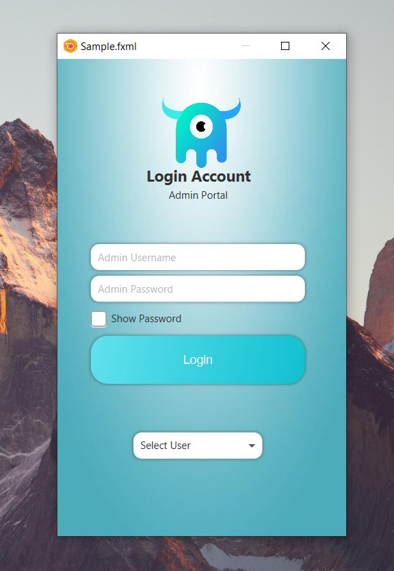
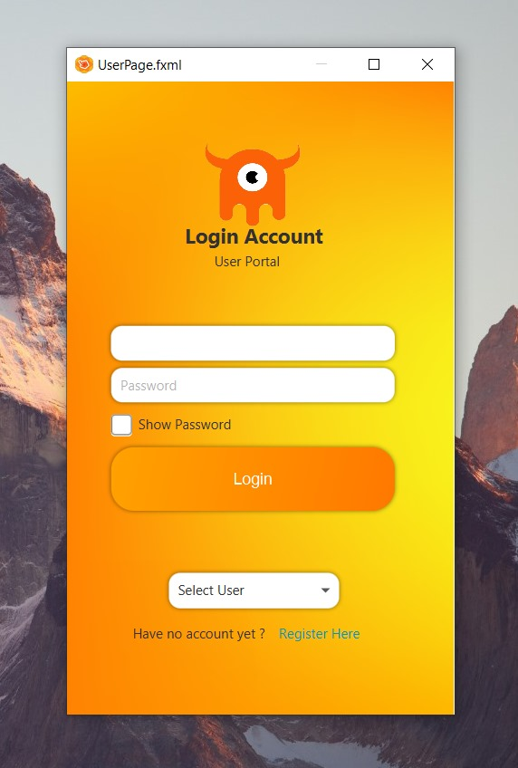
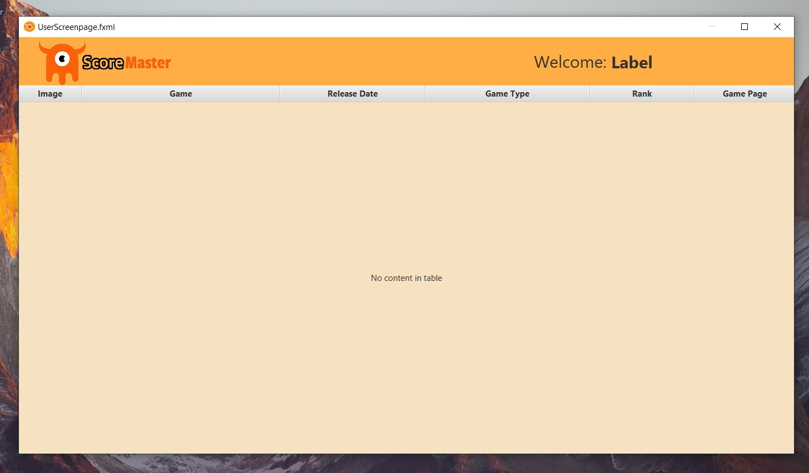
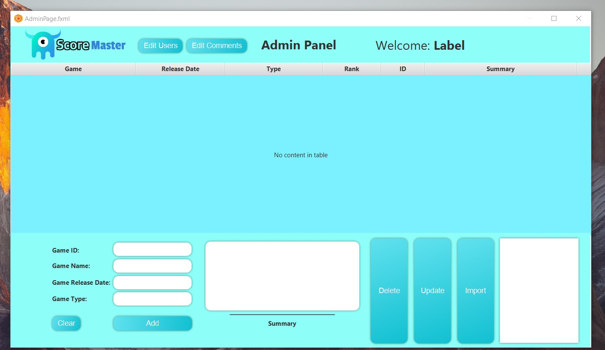
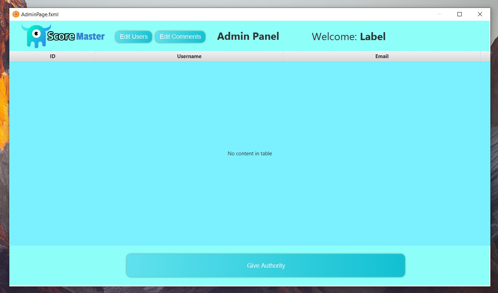
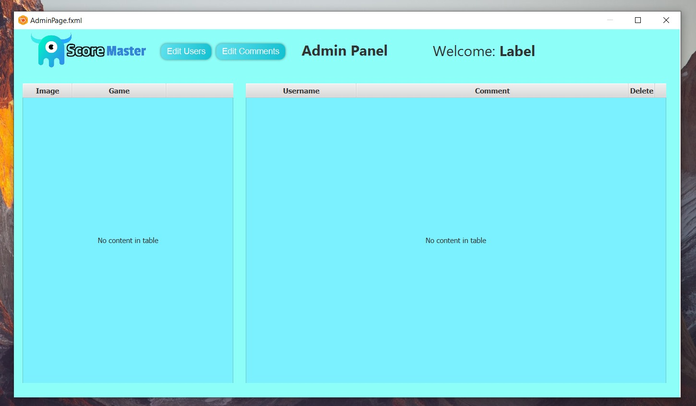
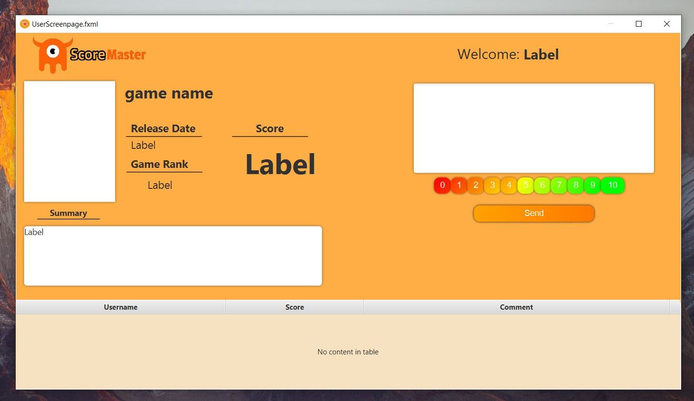

🌍 Switch Language:<br>
🇹🇷 For English, click [here](README.md)<br><br>

🏆 ScoreMaster <br>
&nbsp;&nbsp;&nbsp;Bu JavaFX uygulaması, farklı kullanıcı portalları ve işlevlerini yönetmek için tasarlanmış temel bir kullanıcı arayüzüdür (UI). Uygulama, gelişmiş bir kullanıcı deneyimi sağlamak için çeşitli düğmeler, giriş alanları, onay kutuları ve tablo görünümleri içerir ve her birine özel CSS stilleri uygulanmıştır. Uygulama, kullanıcı kimlik doğrulaması ve yönetim özelliklerini yönetir ve Admin ve User portalları için bileşenler içerir. Uygulama, kullanıcı verilerini işlemek ve dinamik olarak görüntülemek için bir veritabanı ile etkileşime girer.<br><br>

🚀 Özellikler<br>
&nbsp;&nbsp;&nbsp;🖥️ Kullanıcı Portalları<br>
&nbsp;&nbsp;&nbsp;&nbsp;&nbsp;&nbsp;- Admin Portalı: Sistem ayarlarını ve kullanıcı verilerini yönetir.<br>
&nbsp;&nbsp;&nbsp;&nbsp;&nbsp;&nbsp;-  Kullanıcı Portalı: Kullanıcıya özgü işlevlere erişim sağlar.<br><br>
&nbsp;&nbsp;&nbsp;🔒 Güvenlik<br>
&nbsp;&nbsp;&nbsp;&nbsp;&nbsp;&nbsp;- Güvenli giriş ve şifre yönetimi.<br>
&nbsp;&nbsp;&nbsp;&nbsp;&nbsp;&nbsp;- Admin ve kullanıcılar için rol tabanlı erişim.<br><br>
&nbsp;&nbsp;&nbsp;📦 Veritabanı Entegrasyonu<br>
&nbsp;&nbsp;&nbsp;&nbsp;&nbsp;&nbsp;- Veriler MySQL veritabanı üzerinden alınır ve yönetilir.<br>
&nbsp;&nbsp;&nbsp;&nbsp;&nbsp;&nbsp;-  Kullanıcı ve rol verileri için birleşik görünümler kullanılır.<br><br>
&nbsp;&nbsp;&nbsp;📊 Veritabanı Görünümleri<br>
&nbsp;&nbsp;&nbsp;&nbsp;&nbsp;&nbsp;- Sorunsuz veri alma için birleşik SQL görünümü:<br>
`CREATE VIEW user_role_view AS
 SELECT users.user_id, users.username, users.mail_address, roles.role_name
 FROM users
 JOIN roles ON  users.role_id = roles.role_id;`<br><br>
&nbsp;&nbsp;&nbsp;💡 Gelişmiş UI<br>
&nbsp;&nbsp;&nbsp;&nbsp;&nbsp;&nbsp;- JavaFX ve CSS kullanılarak modern bir tasarım oluşturulmuştur.<br>
&nbsp;&nbsp;&nbsp;&nbsp;&nbsp;&nbsp;- Özel düğmeler ve formlar ile hover/pressed efektleri.<br><br><br>


📚 Kullanım<br>
&nbsp;&nbsp;&nbsp;1️⃣ Uygulamayı Çalıştırma.<br>
&nbsp;&nbsp;&nbsp;&nbsp;&nbsp;&nbsp;Uygulamayı başlatmak için ana JavaFX sınıfını çalıştırın.<br>
`mvn clean javafx:run`<br>
&nbsp;&nbsp;&nbsp;&nbsp;&nbsp;&nbsp;Bu komut, uygulamayı başlatacak ve giriş ekranını görüntüleyecektir.<br>
&nbsp;&nbsp;&nbsp;2️⃣ Veritabanı Bağlantısı<br>
&nbsp;&nbsp;&nbsp;&nbsp;&nbsp;&nbsp;Uygulama, MySQL veritabanına bağlantı kurar:<br>
```
public class DatabaseConnection {
    private static final String URL = "jdbc:mysql://localhost:3306/your_database";
    private static final String USER = "root";
    private static final String PASSWORD = "password";

    public static Connection getConnection() throws SQLException {
        return DriverManager.getConnection(URL, USER, PASSWORD);
    }
}
```
&nbsp;&nbsp;&nbsp;3️⃣ Kullanıcı Kimlik Doğrulaması<br>
&nbsp;&nbsp;&nbsp;&nbsp;&nbsp;&nbsp; Sistem, kullanıcıların Admin veya User olarak giriş yapabilmesini sağlayan rol tabanlı kimlik doğrulamasını destekler.<br>

&nbsp;&nbsp;&nbsp;📦 Kurulum<br>
&nbsp;&nbsp;&nbsp;&nbsp;&nbsp;&nbsp;1. Depoyu klonlayın:<br>
`git clone https://github.com/yourusername/javafx-application.git`<br>
&nbsp;&nbsp;&nbsp;&nbsp;&nbsp;&nbsp;2. Bağımlılıkları yükleyin:<br>
`mvn install`<br>
&nbsp;&nbsp;&nbsp;&nbsp;&nbsp;&nbsp;3. Uygulamayı çalıştırın:<br>
`mvn clean javafx:run`<br><br><br>

🌐 Veritabanı Yapısı<br>
&nbsp;&nbsp;&nbsp;Uygulama, aşağıdaki yapıya sahip bir MySQL veritabanına dayanır:<br><br>

&nbsp;&nbsp;&nbsp;Kullanıcılar Tablosu<br>
```
CREATE TABLE users (
    user_id INT PRIMARY KEY,
    username VARCHAR(255) NOT NULL,
    mail_address VARCHAR(255) NOT NULL,
    password VARCHAR(255) NOT NULL,
    role_id INT,
    FOREIGN KEY (role_id) REFERENCES roles(role_id)
);
```

&nbsp;&nbsp;&nbsp;Roller Tablosu<br>
```
CREATE TABLE roles (
    role_id INT PRIMARY KEY,
    role_name VARCHAR(255) NOT NULL
);
```

&nbsp;&nbsp;&nbsp;Birleşik Görünüm<br>
```
CREATE VIEW user_role_view AS
SELECT users.user_id, users.username, users.mail_address, roles.role_name
FROM users
JOIN roles ON users.role_id = roles.role_id;
```
<br>
⚙️ Kullanılan Teknolojiler<br>
&nbsp;&nbsp;&nbsp;- Java (JDK 11 veya üstü)<br>
&nbsp;&nbsp;&nbsp;- Kullanıcı arayüzü için JavaFX<br>
&nbsp;&nbsp;&nbsp;- Veritabanı yönetimi için MySQL<br>
&nbsp;&nbsp;&nbsp;- Bağımlılık yönetimi için Maven<br><br>

📸 Ekran Görüntüleri<br><br>
<br>
<br>
<br>
<br>
<br>
<br>
<br>

📌 Lisans
&nbsp;&nbsp;&nbsp;Bu proje MIT Lisansı ile lisanslanmıştır.
